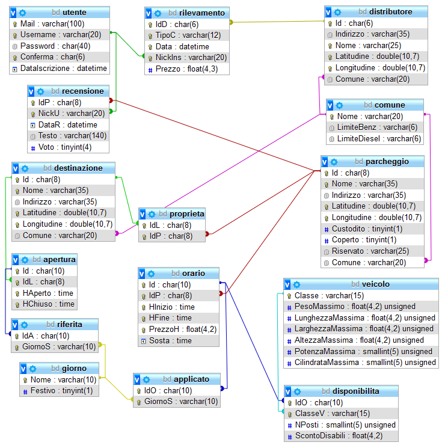
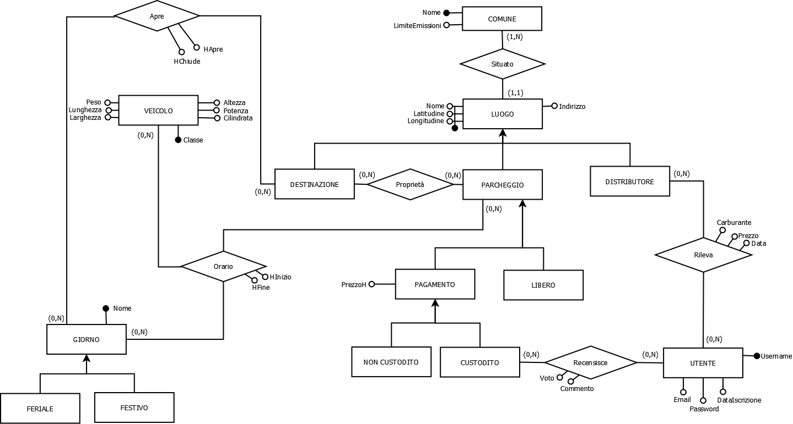
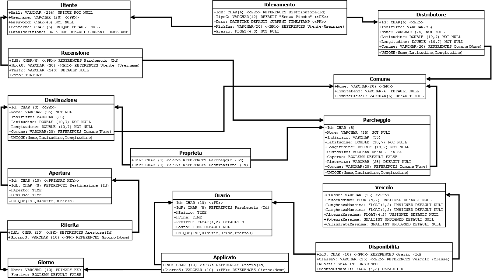

# Progetto Basi di Dati, "Parcheggi"

Progetto per il corso di Basi di Dati per la laurea triennale in Informatica presso [Università degli Studi di Padova](https://www.unipd.it/), inverno 2017.

Il progetto consiste in un database pensato per stare alla base di un sito o un’applicazione aggiornabile da degli utenti registrati (presumibilmente autisti) che permetta di gestire informazioni su luoghi di interesse, parcheggi, stazioni di servizio e relativi orari e prezzi.
In particolare si vogliono individuare informazioni sui servizi nelle vicinanze di una destinazione scelta.

-	Nella cartella *db* è presente il codice per la generazione del database, delle funzioni e dei trigger necessari e un file con delle query di esempio per mostrare le potenzialità del database.
-	Nella cartella *doc* è presente la [relazione completa](doc/Relazione.pdf).

(*Il codice di riempimento del database con valori di esempio è stato omesso dal repository in quanto conteneva nomi e indirizzi di vere attività della città di Padova*.)

## Struttura Database

## Schemi di Progettazione

### Progettazione Concettuale

### Progettazione Logica

